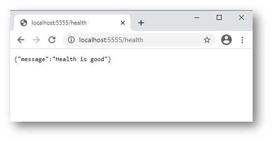
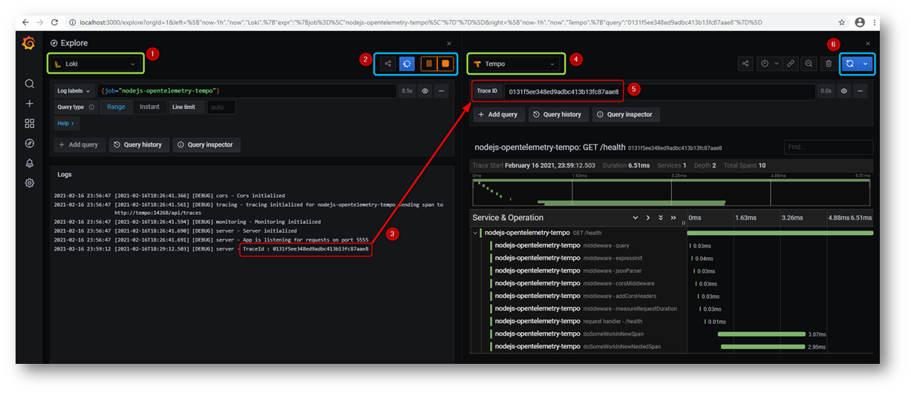
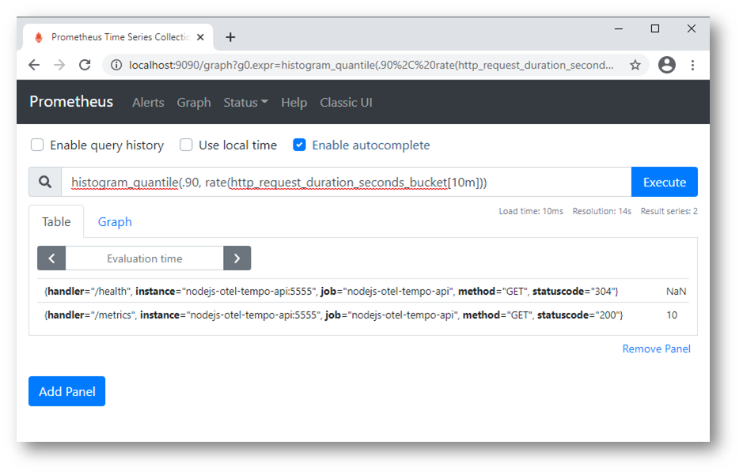

# Project Demonstrating Observability For NodeJs Applications

This is a demo project to demonstrate how we can integrate the following

* [Opentelemetry](https://opentelemetry.io/)
* [Grafan Tempo](https://grafana.com/oss/tempo/) Which internally uses [Jaeger](https://www.jaegertracing.io/)
* [NodeJs Application](https://nodejs.org/en/)

It basically integrates The following

* [Prometheus](https://prometheus.io/) for monitoring and alerting
* [Loki](https://grafana.com/oss/loki/) for Distributed Logging
* [Tempo](https://grafana.com/oss/tempo/) for Distributed Tracing
* [Grafan](https://grafana.com/) for visualization

# Running

````bash
docker-compose up --build
````

Access the endpoint



View the log and trace in grafana




Get the trace information Using Jaeger


View the metrics in prometheus


