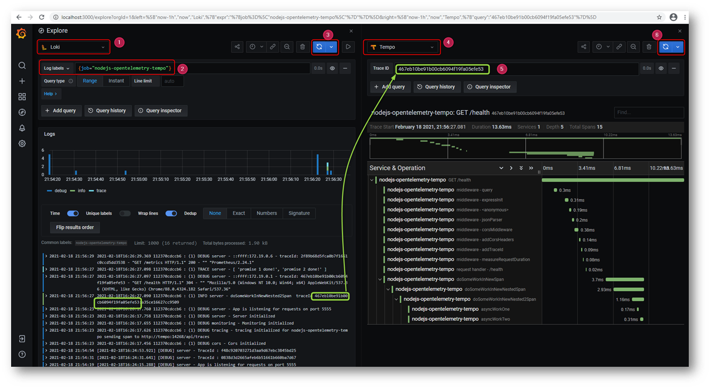
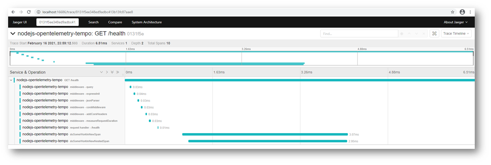
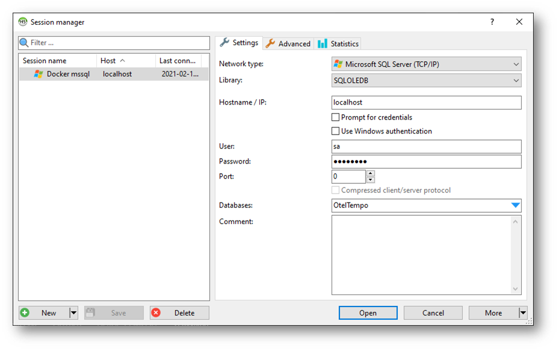
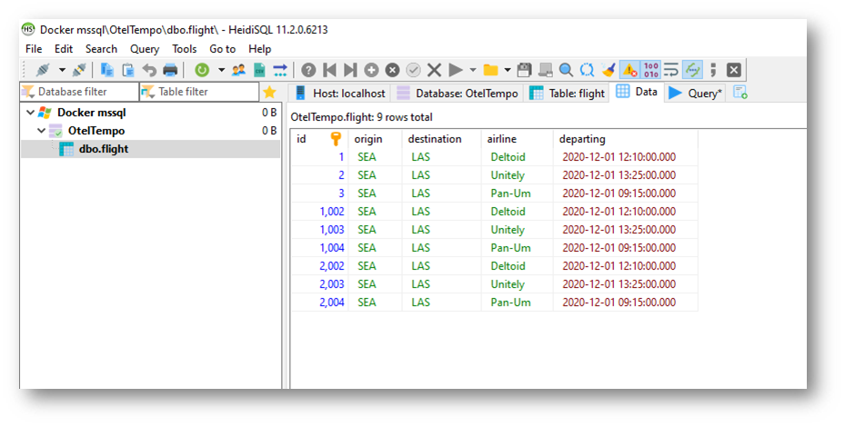

# Project Demonstrating Observability For NodeJs Applications

This is a project demonstrating Observability using :

* [Prometheus](https://prometheus.io/) for monitoring and alerting
* [Loki](https://grafana.com/oss/loki/) for Distributed Logging
* [Tempo](https://grafana.com/oss/tempo/) for Distributed Tracing
* [Grafana](https://grafana.com/) for visualization

And basically integrates the following

* [Opentelemetry](https://opentelemetry.io/)
* [Grafan Tempo](https://grafana.com/oss/tempo/) Which internally uses [Jaeger](https://www.jaegertracing.io/)
* [NodeJs Application](https://nodejs.org/en/)

And basically it demonstrate the best practices for :

* Demonstrate how to use Opentelemetry API
* Logging : Using Log4js
* ES6 : Using Babel
* Metrics : Using Promclient
* Seperating configuration
* Containerization 

# Running

## In Docker

````bash
docker-compose up --build
````

Access the [endpoint](http://localhost:5555/health)


View the log and trace in [Grafana](http://localhost:3000/explore?orgId=1&left=%5B%22now-1h%22,%22now%22,%22Loki%22,%7B%22expr%22:%22%7Bjob%3D%5C%22nodejs-opentelemetry-tempo%5C%22%7D%22%7D%5D&right=%5B%22now-1h%22,%22now%22,%22Tempo%22,%7B%7D%5D)




Get the trace information Using [Jaeger](http://localhost:16686/search)



View the metrics in [Prometheus](http://localhost:9090/graph?g0.expr=&g0.tab=1&g0.stacked=0&g0.range_input=1h)


View prometheus metrics in [Grafana](http://localhost:3000/explore?orgId=1&left=%5B%22now-1h%22,%22now%22,%22Prometheus%22,%7B%7D%5D)


## In Command prompt

Create **.env** file in root folder, refer [this](https://github.com/open-telemetry/opentelemetry-js/blob/v0.16.0/packages/opentelemetry-exporter-jaeger/src/jaeger.ts) for more details on environment variables.

````
LOG_FILE_NAME=nodejs-opentelemetry-tempo.log
OTEL_SERVICE_NAME=nodejs-opentelemetry-tempo
OTEL_EXPORTER_JAEGER_ENDPOINT=http://localhost:14268/api/traces
DB_USER=sa
DB_PASS=P@ssw0rd
DB_SERVER=otmssql
DB_NAME=OtelTempo
````

Create Network

````bash
docker network create docker-tempo
````

Start tempo

`ABSOLUTE_PATH_OF_PROJECT = E:\githubRepos\nodejs-opentelemetry-tempo`

````bash
docker run -d --rm -p 6831:6831/udp -p 6832:6832/udp -p 9411:9411 -p 55680:55680 -p 3100:3100 -p 14250:14250 -p 14268:14268 --name tempo -v ${ABSOLUTE_PATH_OF_PROJECT}\etc\tempo-local.yaml:/etc/tempo.yaml --network docker-tempo  grafana/tempo:latest --config.file=/etc/tempo.yaml
````

Start tempo query

````bash
docker run -d --rm -p 16686:16686 --name tempo-query -v ${ABSOLUTE_PATH_OF_PROJECT}\etc\tempo-query.yaml:/etc/tempo-query.yaml  --network docker-tempo  grafana/tempo-query:latest  --grpc-storage-plugin.configuration-file=/etc/tempo-query.yaml
````

Start mssql

````
docker run  -p 1433:1433 -d -e ACCEPT_EULA=Y --name otmssql -e SA_PASSWORD=P@ssw0rd --network docker-tempo mcr.microsoft.com/mssql/server
````

Connect to mssql and create db `OtelTempo` and table as in `.data\db\mssql\scripts`

````bash
npm install
````

````bash
npm run dev
````

Access the [endpoint](http://localhost:5555/health)


Get the trace information in [Jaeger](http://localhost:16686/search)


# Connecting To MSSQL DB

Lets connect to MSSQL DB running on container from Windows machine





**Note** :  I have use [heidisql](https://www.heidisql.com/), other option would be [dbeaver](https://dbeaver.io/download/)

# Also See

* [Java Opentelemetry Tempo](https://github.com/mnadeem/boot-opentelemetry-tempo)
* [opentelemetry-instrumentation-mssql](https://github.com/mnadeem/opentelemetry-instrumentation-mssql)

# References

* [Opentelemetry Specification](https://github.com/open-telemetry/opentelemetry-specification/blob/main/specification/overview.md)
* [Opentelemetry NodeJs Getting Started](https://opentelemetry.io/docs/js/getting_started/nodejs/)
* [Opentelemetry NodeJs Getting Started On Github](https://github.com/open-telemetry/opentelemetry-js/blob/main/getting-started/README.md)
* [Opentelemetry NodeJs Packages](https://github.com/open-telemetry/opentelemetry-js/tree/main/packages)
* [Opentelemetry Js Examples](https://github.com/open-telemetry/opentelemetry-js/tree/main/examples)
* [Opentelemetry Js Contrib Examples](https://github.com/open-telemetry/opentelemetry-js-contrib/tree/main/examples)
* [Opentelemetry Js Jaeger Exporter](https://github.com/open-telemetry/opentelemetry-js/tree/v0.16.0/packages/opentelemetry-exporter-jaeger)
